# tuNota — Guía visual de funcionalidades

| | |
|---|---|
| **Proyecto** | tuNota |
| **Generado** | 2026-07-09 09:51 -05 |
| **Rama** | `feature/ia-python-dibujo-tema` |
| **Commit** | `b89478f` — Topbar limpio, alinear/distribuir selección, duplicar bloque y pulido visual |
| **Estado del árbol** | ⚠️ con cambios sin confirmar: las capturas reflejan el *working tree*, no exactamente ese commit |
| **Autor** | Sergio Ramos |

Recorrido con capturas de todo lo que hace tuNota: un lienzo infinito donde cada idea es un
bloque que puedes conectar, organizar y enriquecer con IA. Las imágenes viven en
`docs/screenshots/`.

---

## 1. El lienzo y los bloques

### Vista general
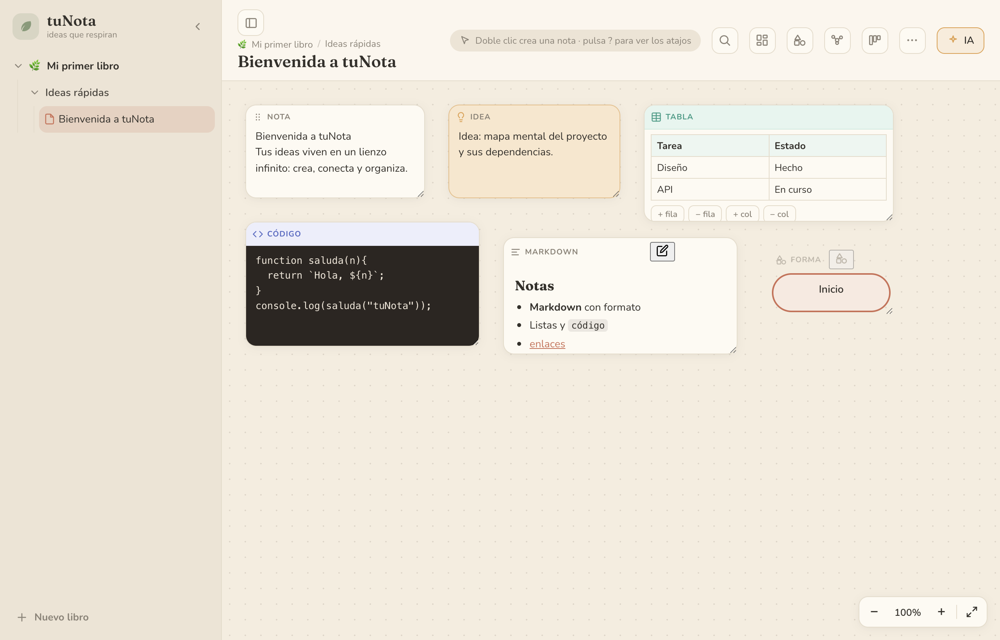

La pantalla principal: a la izquierda el **panel de libros → secciones → notas**; arriba la
**barra de herramientas** (buscar, plantillas, formas, mapa, kanban, más opciones e IA); y en
el centro el **lienzo infinito** con bloques de distintos tipos —una **Nota**, una **Idea**
(con color cálido), una **Tabla**, un bloque de **Código**, uno de **Markdown** ya
renderizado y una **Forma** («Inicio»). Cada bloque se mueve, redimensiona y conecta.

### Menú radial: insertar cualquier bloque
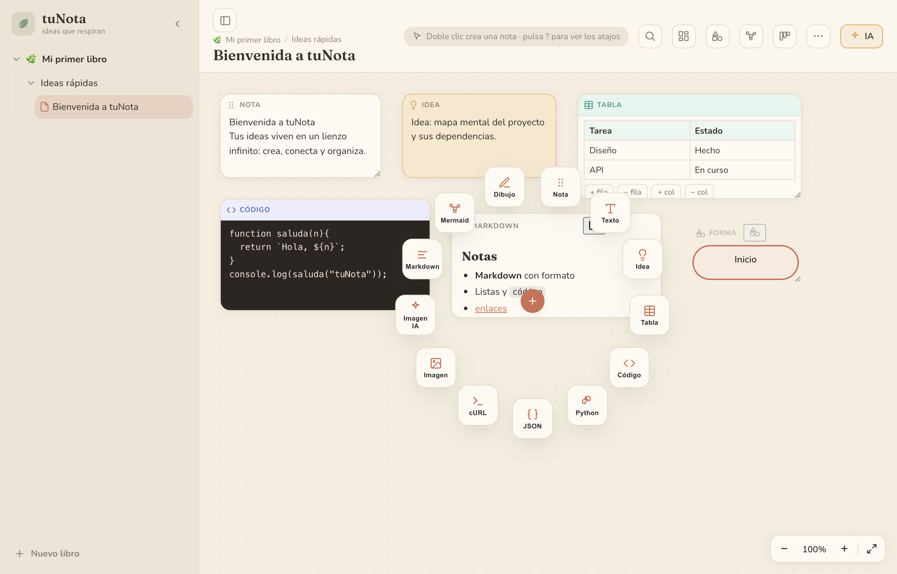

Manteniendo **Alt** (o con **Ctrl+clic**) sobre el lienzo aparece el **menú radial** con los
14 tipos de bloque: Nota, Texto, Idea, Tabla, Código, Python, JSON, cURL, Imagen, Imagen IA,
**Forma**, Markdown, Mermaid y Dibujo. El anillo se ajusta para no solaparse y se mantiene
dentro de la ventana. También puedes crear una Nota con **doble clic** en el vacío.

---

## 2. Diagramación (estilo Lucidchart/Visio)

### Formas / stencils
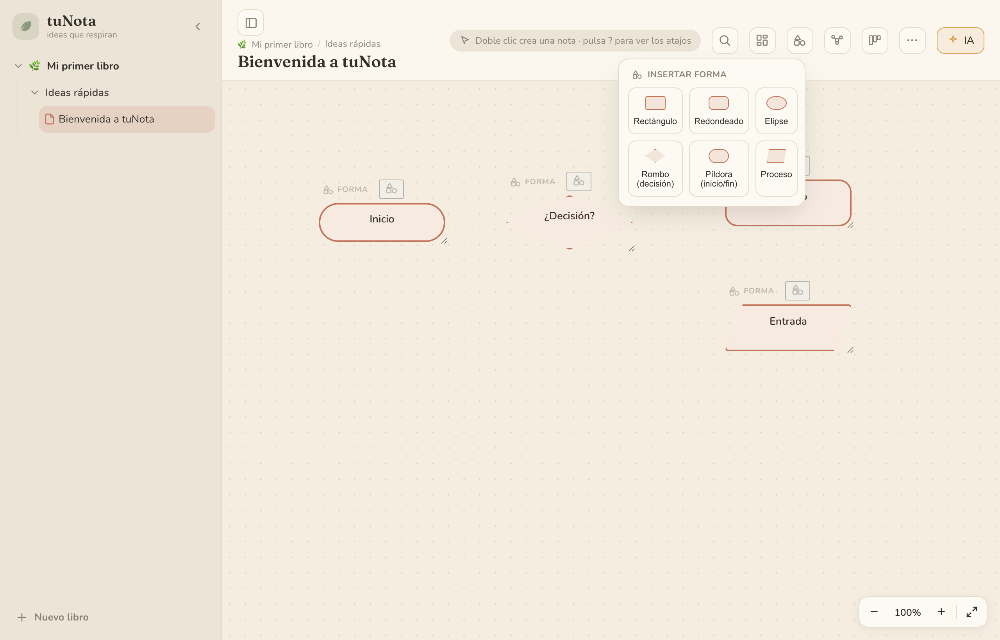

El botón de **Formas** abre una paleta para insertar rectángulos, redondeados, elipses,
**rombos de decisión**, **píldoras** de inicio/fin y **paralelogramos** de proceso. Detrás se
ven varias formas ya colocadas en el lienzo. El tipo de cada forma se cambia desde su tarjeta.

### Conexión rápida y nodos de proceso
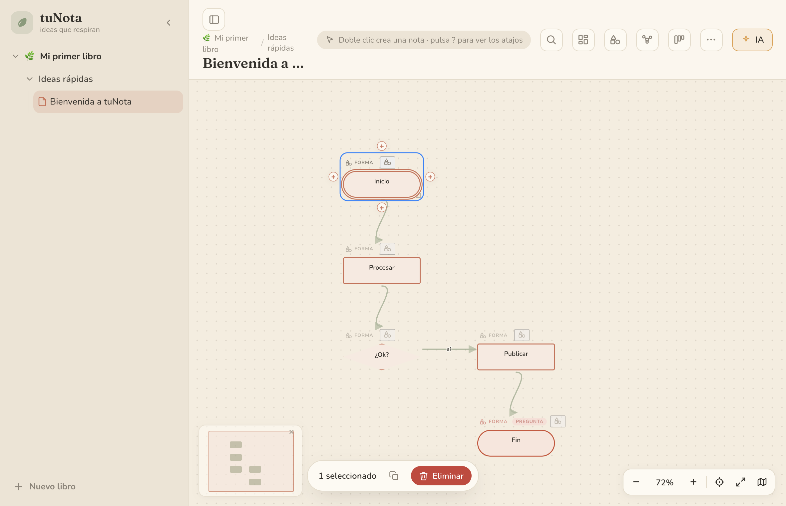

Al pasar el ratón por una forma aparecen 4 manijas **+** en los costados: un clic crea un
bloque **ya conectado** en esa dirección y eliges qué es —**Paso** (rectángulo), **Decisión**
(rombo), **Subproceso**, **Inicio/Fin** o **Fin del proceso (rojo)**—. Así montas un
flujograma en segundos. Las formas se redimensionan con su manija y se pueden colorear. Para
**duplicar** cualquier bloque: menú de tarjeta, botón de la barra de selección, o **Ctrl/⌘+D**
(duplica también los conectores internos de una selección).

### Conectores con tipo, etiqueta y ruteo
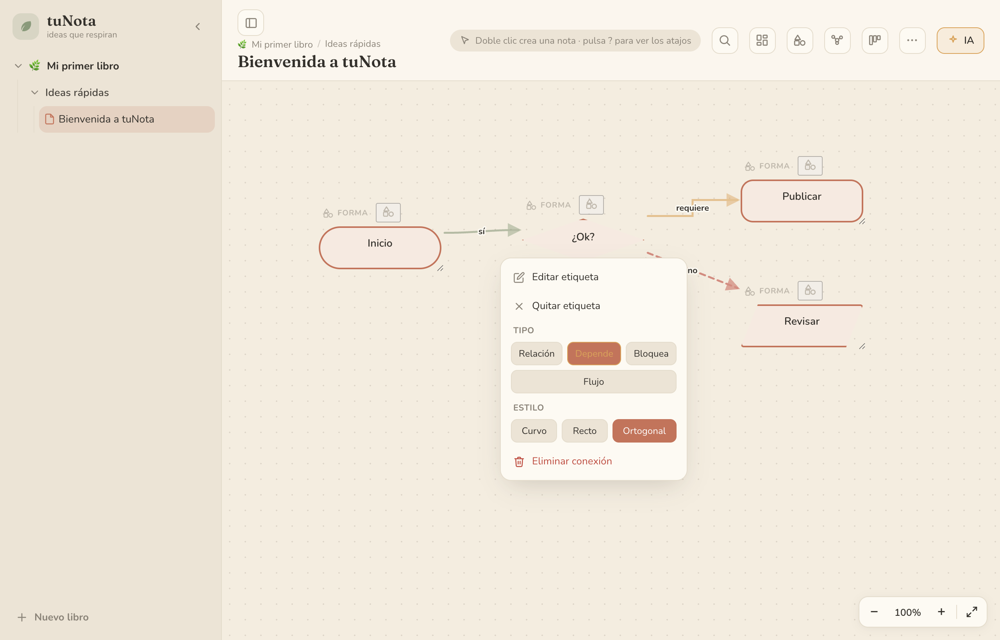

Los bloques se enlazan **borde a borde** con **flecha direccional**. Cada conector puede
llevar **etiqueta** («sí», «requiere», «no»), un **tipo semántico con color** (relación,
depende, bloquea, flujo) y un **estilo de ruteo** (curvo, recto u ortogonal). Al hacer clic
sobre una conexión se abre el menú que ves a la derecha para editar todo eso o eliminarla.

### Guías inteligentes + snap
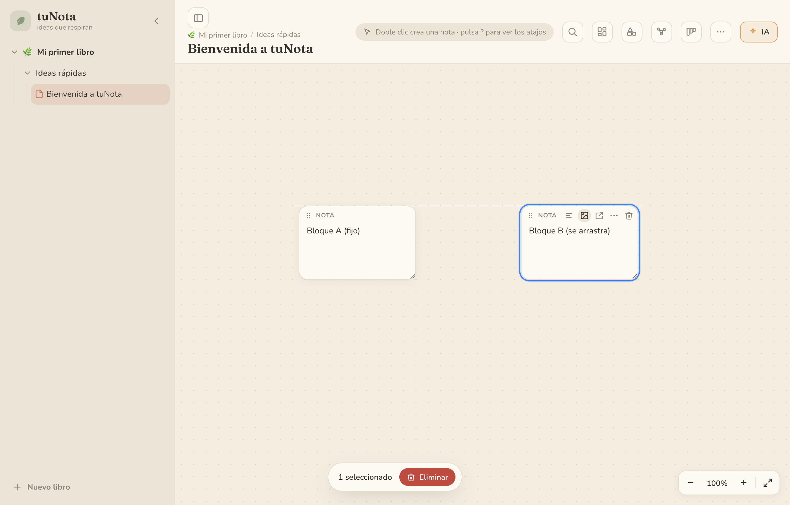

Al arrastrar un bloque, tuNota muestra **líneas guía** y lo **engancha** a los bordes o al
centro de los demás (y a la rejilla). En la captura, el «Bloque B» se alinea por su borde
superior con el «Bloque A» y aparece la guía roja que confirma la alineación.

---

## 3. Organizar y actuar sobre los bloques

### Menú de tarjeta
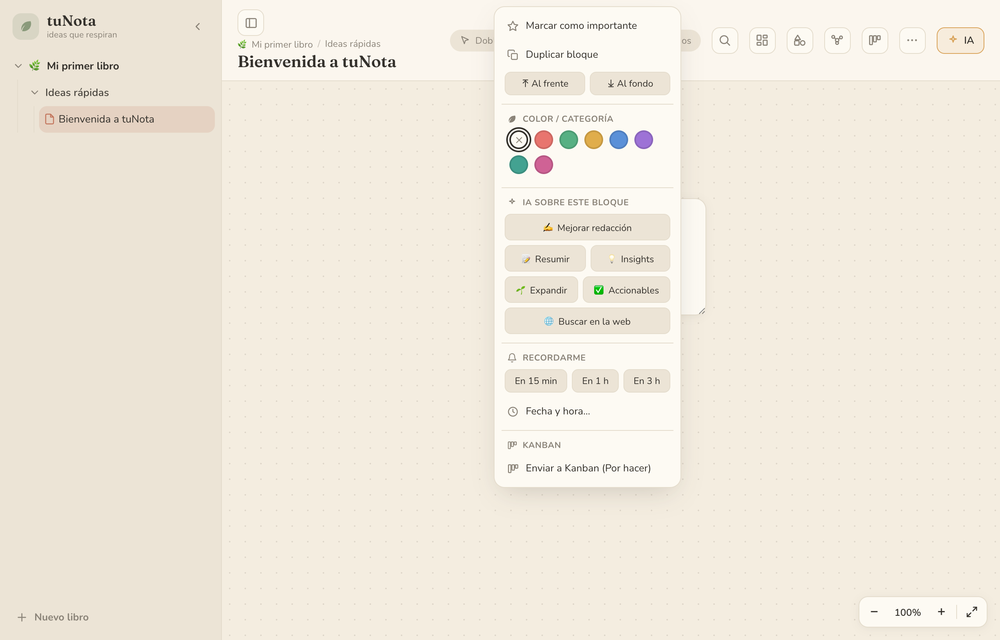

Cada bloque tiene un menú (⋯) con: marcar como **importante**, **duplicar**, **traer al
frente / enviar al fondo** (z-order), **color/categoría**, acciones de **IA** sobre su
contenido (mejorar, resumir, insights, expandir, accionables y **buscar en la web**) y
**recordatorios**.

### Selección múltiple, alinear y distribuir
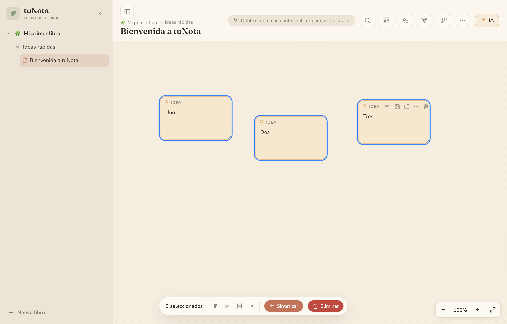

Arrastrando en el vacío haces una **selección por marco**. Con varios bloques seleccionados
aparece la barra inferior para **alinear**, **distribuir**, **sintetizar con IA** o
**eliminar** el grupo. Los bloques también se mueven juntos.

---

## 4. Contenido enriquecido y multimedia

### Imagen IA (buscar o generar)
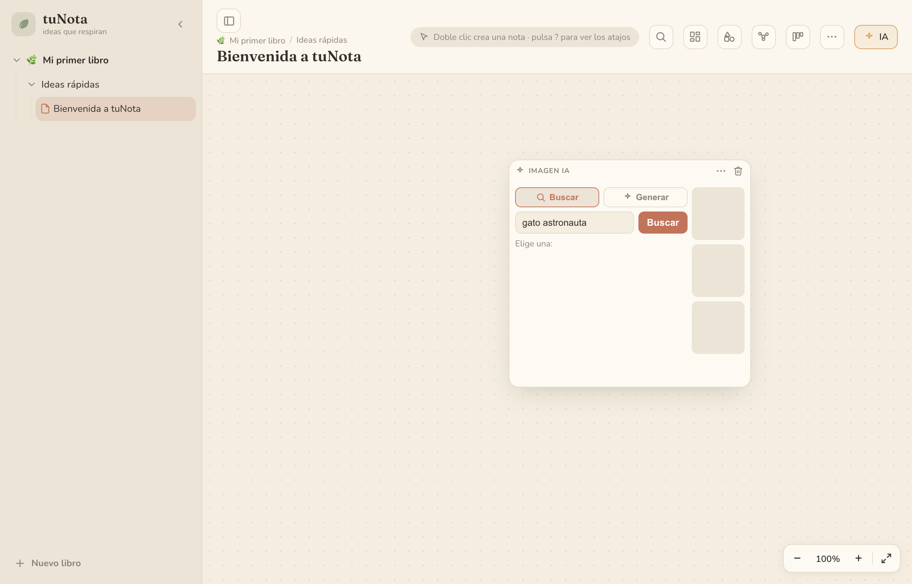

Un bloque especial para **buscar imágenes** en la web (Tavily) o **generarlas por prompt**.
Escribes una descripción, eliges el modo y seleccionas una miniatura de resultados para
colocarla en el lienzo.

### Diagramas Mermaid
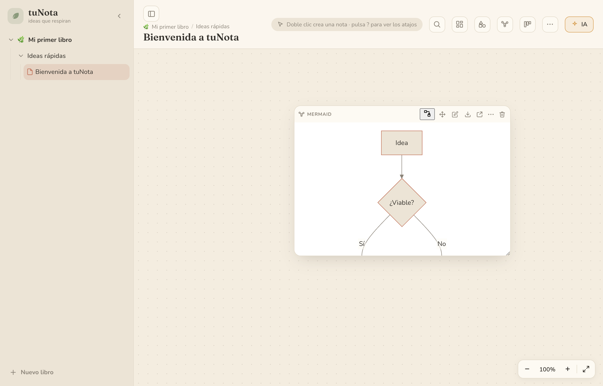

Bloques de **diagrama Mermaid** que se renderizan en vivo (diagramas de flujo, secuencia,
etc.). Incluyen herramienta de tipo de diagrama, formas rápidas, generación con IA, edición
del código y exportación a PNG.

### Puente Mermaid ↔ lienzo
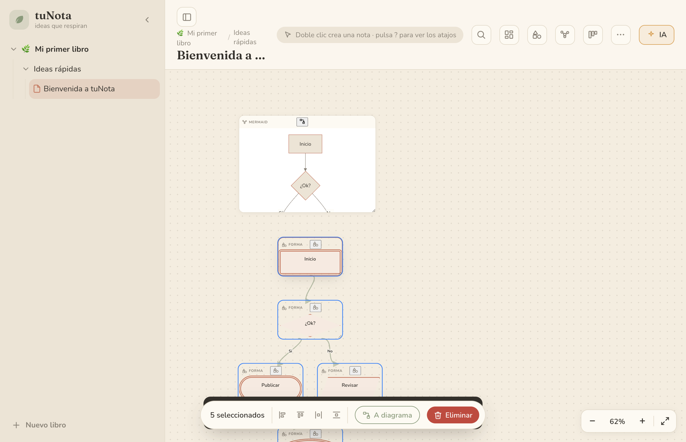

Un flowchart Mermaid (arriba) **explotado** a formas y conectores nativos (abajo): cada nodo
es una forma editable —rectángulo, rombo de decisión, píldora, paralelogramo— y las flechas
**siguen a las cajas** cuando las arrastras (lo que el modo interactivo del SVG no hacía
bien). El botón **A diagrama** de la barra de selección hace el camino inverso: convierte las
formas y sus conexiones de vuelta en un diagrama Mermaid.

---

## 5. Plantillas y vistas

### Plantillas de canvas
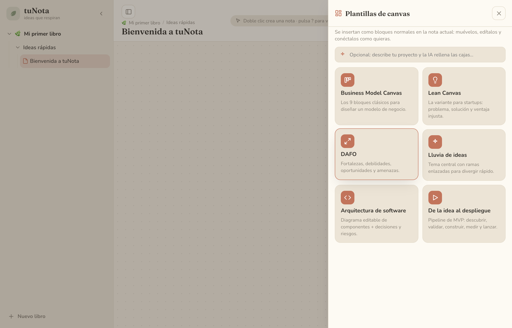

Plantillas listas para empezar —**Business Model Canvas**, **Lean Canvas**, **DAFO**,
**Lluvia de ideas**, **Arquitectura de software** y **De la idea al despliegue**— que
colocan un conjunto de bloques organizados en el lienzo. Opcionalmente puedes describir tu
proyecto y que la **IA rellene las cajas** por ti.

### Mapa de conocimiento
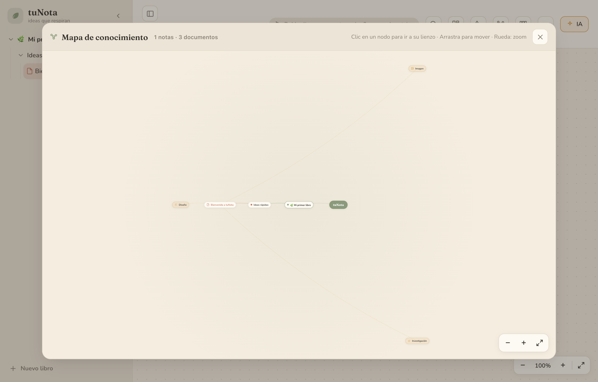

Una vista tipo grafo de **todo tu contenido**: libros, secciones, notas y documentos como
nodos con **aristas curvas**. Se auto-encuadra, tiene zoom, muestra un contador y **resalta
los vecinos** al pasar el ratón. Un clic en un nodo te lleva a su lienzo.

### Kanban de ideas
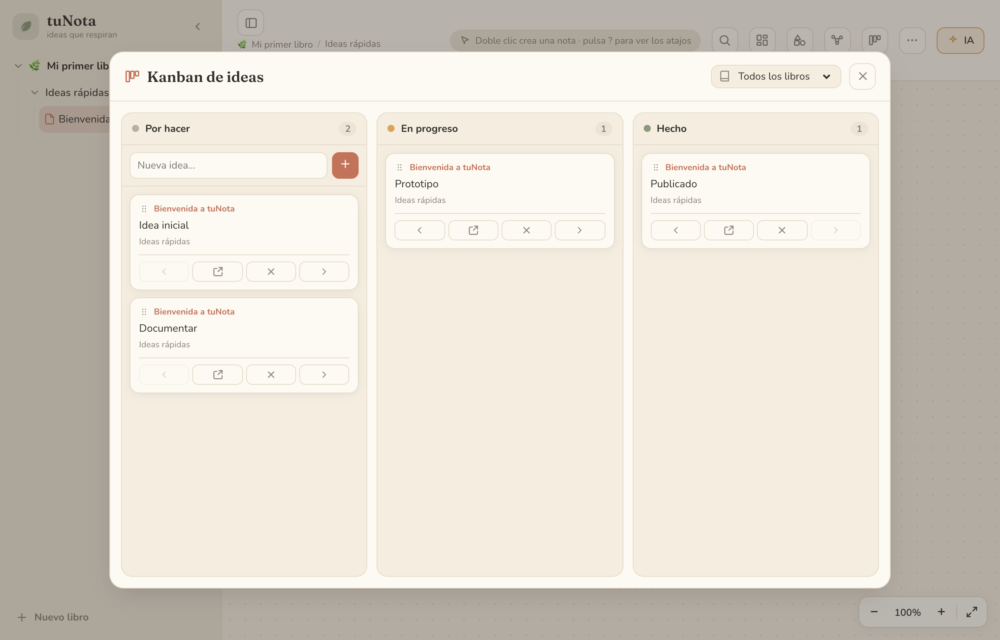

Un **tablero Kanban** que organiza los bloques por estado (por hacer, en curso, hecho),
útil para llevar el avance de tareas sin salir de tuNota.

### No perderse en el lienzo
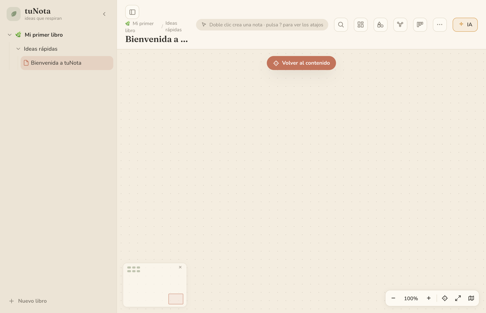

Mecanismos para orientarte en un lienzo infinito: cuando te alejas y **ningún bloque está a
la vista**, aparece el botón **«Volver al contenido»**. Abajo a la izquierda, el **minimapa**
muestra todos los bloques y un recuadro con la zona que estás viendo (clic para saltar allí).
En el control de zoom tienes **Centrar** (diana: vuelve al 100% centrado en el contenido),
**Ajustar todo** y el interruptor del minimapa. Atajos: `Ctrl+0` centra, `Ctrl+1` ajusta.

### Búsqueda global
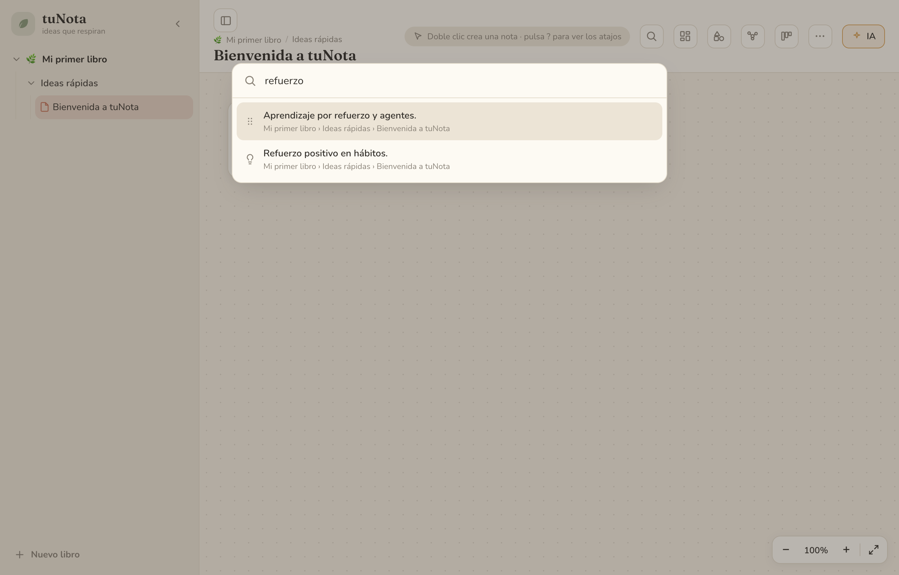

Con **Ctrl+K** abres la búsqueda que recorre todas las notas y bloques y te lleva al
resultado. En la captura, «refuerzo» encuentra los bloques que lo mencionan.

---

## 6. Inteligencia artificial

### Asistente de IA
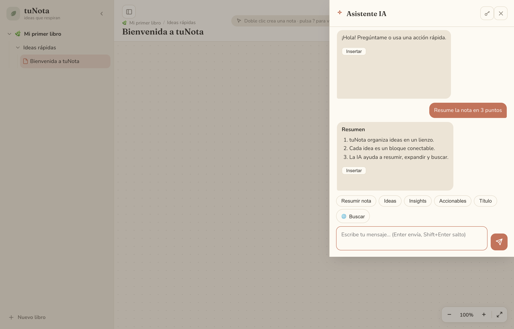

Un panel de **chat** con acciones rápidas (resumir la nota, generar ideas, insights,
accionables, título). Cada respuesta se puede **insertar** como bloque en el lienzo.

### Configuración de IA
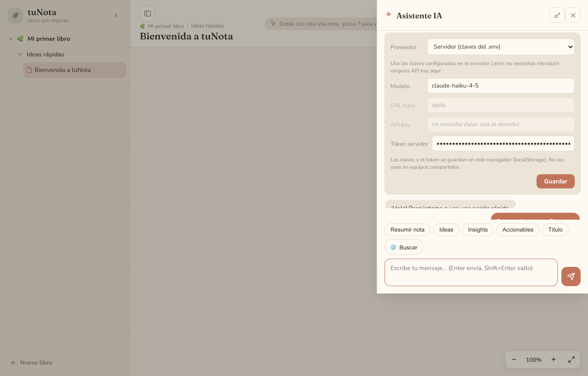

Elige proveedor: el **servidor** (usa las claves del `.env`, sin pegar nada) con su lista de
**modelos**, o tu propia clave (OpenAI, Groq, OpenRouter, Gemini, Anthropic…). Incluye campo
de **token del servidor** para el acceso protegido.

### Búsqueda en internet con IA
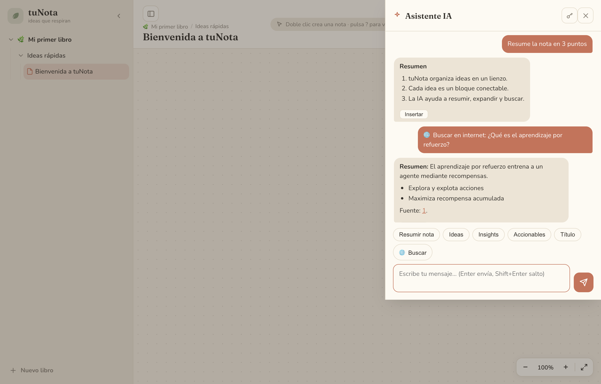

El chip **🌐 Buscar** consulta internet (Tavily) y la IA redacta una respuesta **citando las
fuentes**. También disponible como acción sobre un bloque concreto.

---

## 7. Personalización

### Paletas de color
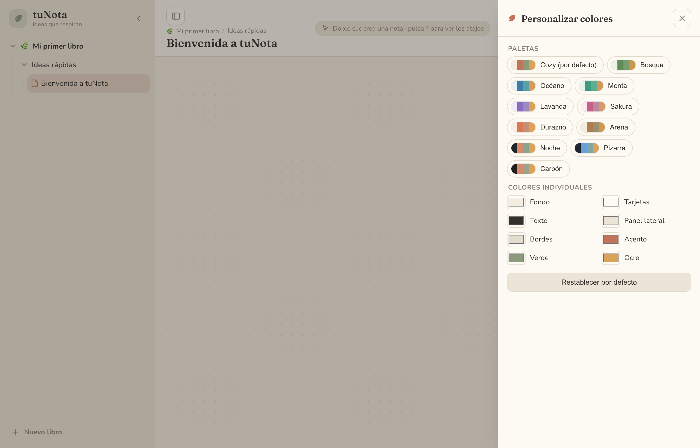

**11 temas** con **vista previa** de sus colores (Cozy, Bosque, Océano, Menta, Lavanda,
Sakura, Durazno, Arena, Noche, Pizarra, Carbón) y ajuste **color por color**. Los cambios se
aplican al instante a toda la interfaz.

### Tema oscuro aplicado
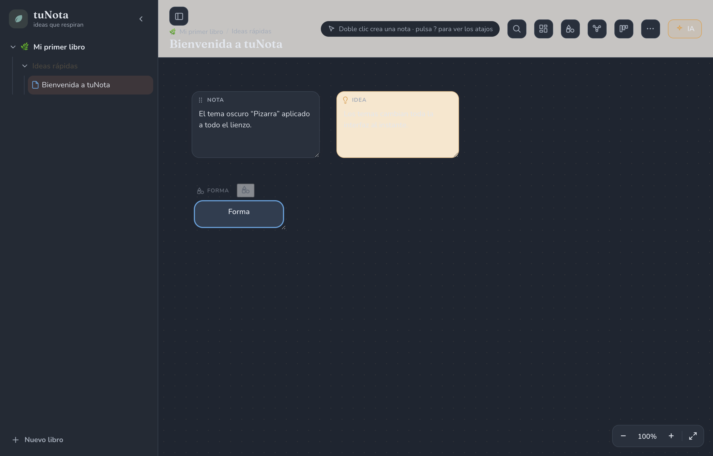

Ejemplo del tema oscuro **«Pizarra»** aplicado al lienzo, las tarjetas y las formas: la
personalización afecta a toda la aplicación, no solo al fondo.

---

## 8. Gestión, datos y ayuda

### Historial de cambios
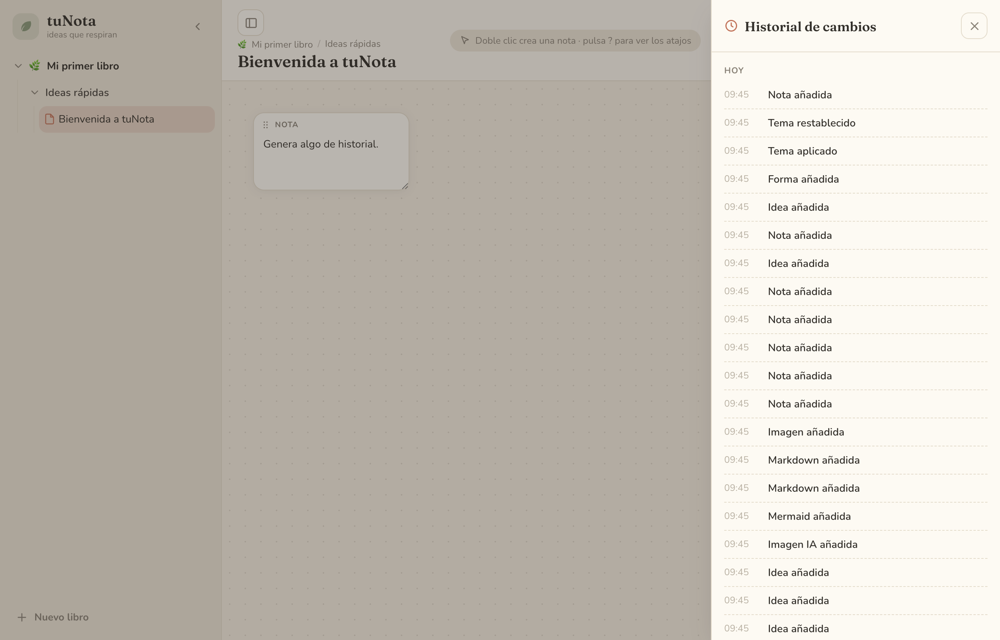

Un **registro** de las acciones recientes (bloques creados/editados, temas aplicados, etc.)
para saber qué ha cambiado.

### Copias de seguridad
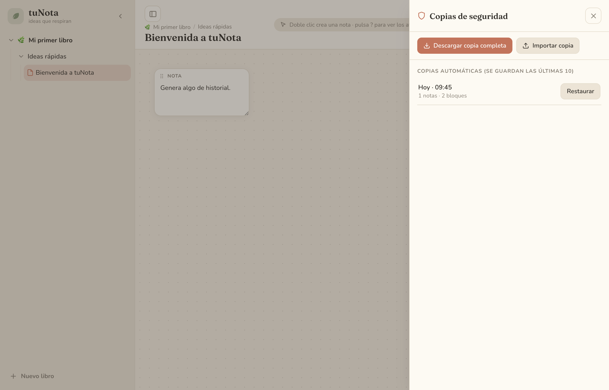

Gestión de **copias de seguridad**: exportar/importar tus datos y restaurar instantáneas
automáticas. Útil para no perder nada y migrar entre equipos.

### Atajos de teclado
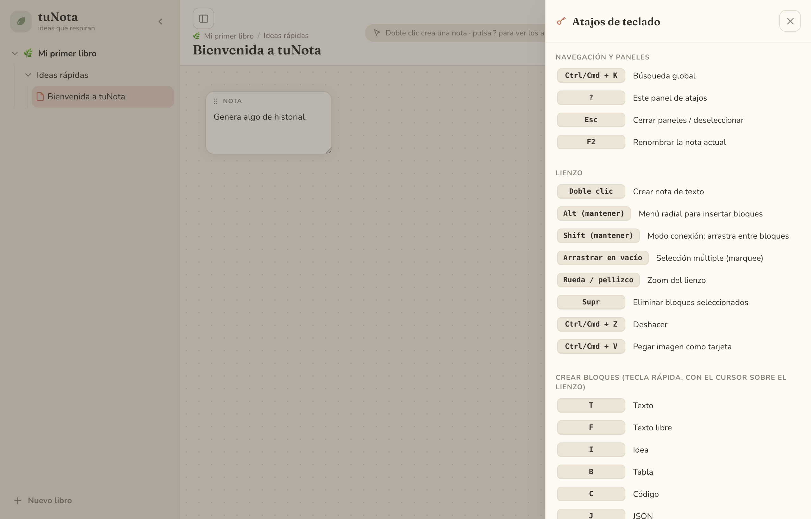

La chuleta de **atajos** (crear bloques con una tecla, deshacer, buscar, zoom, menú radial…)
que abres pulsando **?**.

### Integraciones y versiones
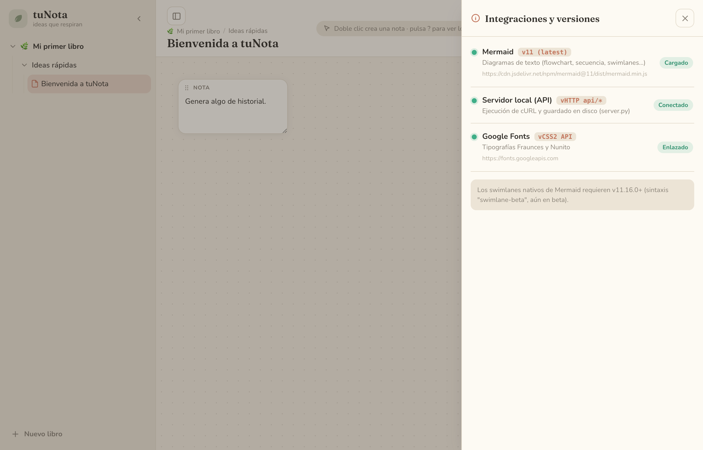

Estado de las **integraciones** y sus versiones: **Mermaid** (diagramas), el **servidor
local** (API `api/*` para ejecutar cURL y guardar en disco con `server.py`) y **Google
Fonts** (tipografías). Cada una indica si está cargada/conectada. Desde el menú «⋯» también
puedes **importar Markdown o PDF**.

---

## 9. Ayuda y showcase

### Tour visual guiado
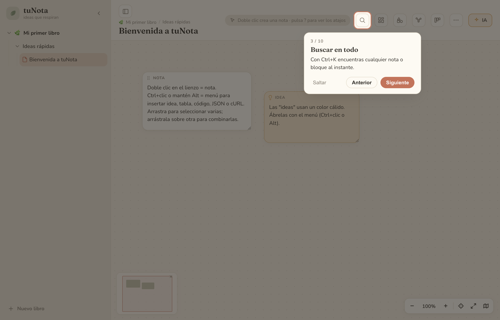

Una **guía interactiva** que resalta cada parte de la interfaz con un foco y una tarjeta
explicativa, paso a paso (Anterior/Siguiente/Saltar, o las flechas del teclado). **Se
auto-lanza en la primera visita** (tras la puerta de acceso, si la hay) empezando por una
bienvenida; después queda disponible cuando quieras desde el menú **«⋯» → «Tour visual»** o
el botón del estado inicial. Se recuerda para no repetirse (`ui.tourSeen`).

### Página de showcase
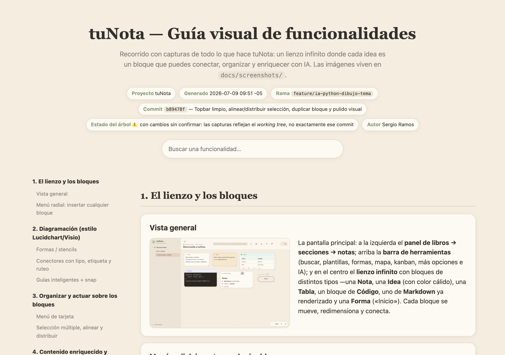

Esta misma guía exportada como **página web dinámica** (`docs/showcase.html`): buscador de
funcionalidades, índice lateral con scroll-spy y **lightbox** para ampliar las capturas. Se
genera desde este Markdown con `node docs/build-showcase.cjs` y se abre desde
**«⋯» → «Showcase de funcionalidades»**.

### Puerta de acceso (compartir con token)
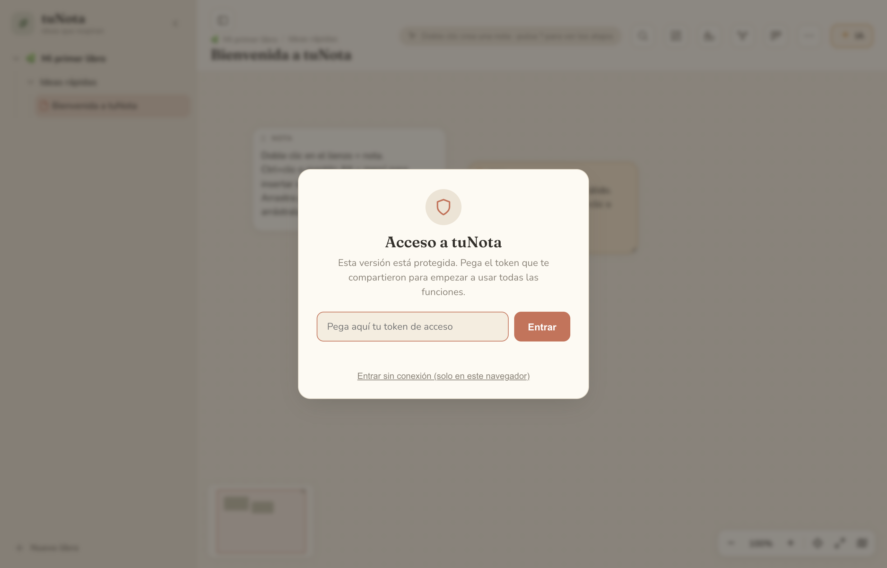

Cuando la instancia está **protegida** (desplegada con token), al entrar aparece este
recuadro pidiendo el **token de acceso**. Compártelo con quien quieras: lo pegan una vez,
entran y usan todas las funciones; se recuerda para no volver a pedirlo. En local no aparece
(el token se auto-rellena). También puedes compartir un **enlace de confianza**
`…/?token=EL_TOKEN` que entra directamente.
